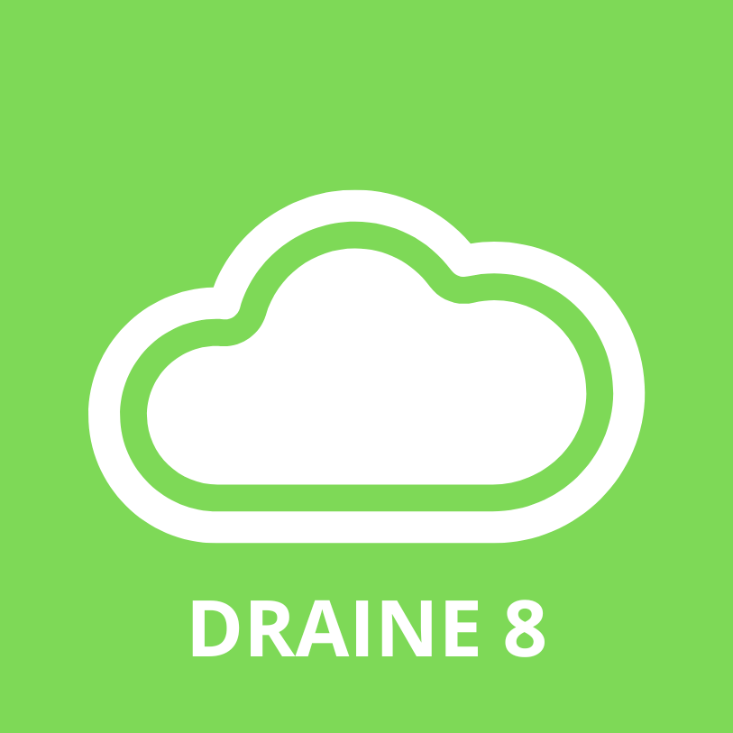

# DRAINE-algorithm
DRAINE 8 algorithm

DRAINE 8

Overview
DRAINE 8 is a Python-based encryption and decryption tool that transforms sentences by replacing each word with a random permutation of its letters. The encrypted text can then be decrypted by comparing the permutations with a predefined word list.

Features
Encryption: Transforms each word in a sentence into a random permutation of its letters.
Decryption: Reconstructs the original sentence by comparing permutations with a word list.
Word List Integration: Uses a word list file (word_lst.txt) to validate and reconstruct the original words.
Case-insensitive processing: Processes words in a case-insensitive way for greater consistency.
Prerequisites

Python 3.6 or higher.

  

